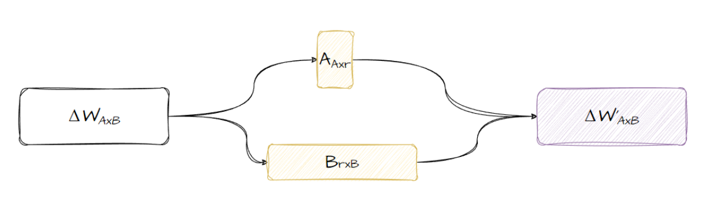

# Fine-Tuning llama

## Chapter 1: Introduction

### Large Language Model lifecycle


* **Vision and Scope** : First, you should define the project's vision. Determine if your LLM will be a more universal tool or target a specific task like named entity recognition. Clear objectives save time and resources.
* **Model selection** : Choose between training a model from scratch or modifying an existing one. In many cases, adapting a pre-existing model is efficient, but some instances require fine-tuning with a new model.
* **Model's perfomance and adjusment** : After preparing your model, you need to assess its performance. If its unsatisfactory, try prompt engineering or further **fine-tuning**. We'll focus on this part. Ensure the model's outputs are in sync with human preferences.
* **Evaluation and iteration** : Conduct evaluations regularly using metrics and benchmarks. Iterate between prompt engineering, fine-tuning, and evaluation until you reach the desired outcomes.
* **Deployment** : Once the model performs as expected, deploy it. Optimize for computational efficiency and user experience at this juncture.

### **What is Fine-Tuning** **?**

LLM fine-tuning is the process of taking pre-trained models and further them on smaller, specific datasets to refine their capabilities and improve perfomance in a particular task. indeed, Fine-tuning is about turning general-purpose models and turning them into specialized models.It bridges the gap between generic pre-trained models and the unique requirements of specific applications, ensuring that the language model aligns closely with human expectations.

### **What does Fine-Tuning do for the model ?**

* Lets add you more data into the model than what fits into the prompt.
* Gets the model to learn the data rather than just get access to it.

  

### **When we can use Fine-Tuning ?**

* **In-context learning** is a method for improving the prompt through specific task examples within the prompt, offering the LLM a blueprint of what it needs to accomplish.
* **Zero-shot inference** incorporates your input data in the prompt without extra examples. If zero-shot inference doesn't yield the desired results, **'one-shot' or 'few-shot inference'** can be used. These tactics involve adding one or multiple completed examples within the prompt, helping smaller LLMs perform better.

  
* These are techniques used directly in the user prompt and aim to optimize the model's output and better fit it to the user's preferences. The problem is that they dont always work, especially for smaller LLMs. Here's an example of how in-context learning may fail.

  Other than that, any examples you include in your prompt take up valuable space in the context window, reducing the space you have to include additional helpful information. And here, finally, comes fine-tuning. Unlike the pre-training phase, with vast amounts of unstructured text data, **fine-tuning is a supervised learning process.** This means that you use a dataset of labeled examples to update the weights of LLM. These labeled examples are usually prompt-response pairs, resulting in a better completion of specific tasks.
* Supervised Fine-Tuning (SFT)

  ....

## Chapter 2: Methods

### Using PEFT to do a LoRA techniques

#### What is PEFT and LoRA ?


##### PEFT (Parameter-Efficient Fine-Tuning):

* Is a library for efficiently adapting PLMs (pre-trained language models) to various downstream applications without fine-tuning all the model's parameters. PEFT methods only fine-tune a small number of (extra) model parameters, significantly decreasing computational and storage costs because fine-tuning large-scale PLMs is prohibitively costly. Recent state-of-the-art PEFT techniques achieve performance comparable to that of full fine-tuning.
* supported methods :
  1. [LoRA](https://arxiv.org/abs/2106.09685)
  2. [Prefix Tuning](https://arxiv.org/abs/2106.09685)
  3. [P-Tuning](https://arxiv.org/abs/2103.10385)
  4. [Prompt Tuning](https://arxiv.org/abs/2104.08691)
  5. [AdaLoRA](https://arxiv.org/abs/2303.10512)
  6. [$(IA)^3$](https://arxiv.org/abs/2205.05638)
  7. [MultiTask Prompt Tuning](https://arxiv.org/abs/2303.02861)
  8. [LoHA](https://arxiv.org/abs/2108.06098)
  9. [LoKr](https://arxiv.org/abs/2212.10650)

##### Low-Rank Adaptation (LoRA):

###### What is LoRA?


LoRA is more of an adapter approach, where it introduces new parameters into the model to train the model through these new parameters. The trick is in how the new params are introduced and merged back into the model, without increasing the total number of params in the model.
These new parameters are added only for the training step, they are not introduced as a part of the model. This keeps the model size completly the same and still offers the flexibility of parameter-efficient finetuning.

###### How does LoRA work?

LoRA works by breaking down the weight update matrix into smaller matrices and using them to train the model. Take a look at the diagram below, the ΔWAxB is the weight update matrix, the matrix of learned changes from backpropagation, this is the same size as the number of parameters we need to update to finetune our model. This matrix, or any matrix, can be represented as a set of smaller matrices, presented here as A and B with r as their rank. The r parameter controls the size of the smaller matrices.

These smaller matrices can then be used to train the model using normal backpropagation but updating the parameters in the smaller matrices rather than updating directly in the model. We basically learn the ΔW through the smaller matrices. These smaller matrices can then be multiplied together to get back the original matrix. As these matrices are much smaller, this process uses fewer parameters and as a result much fewer computation resources. This also results in smaller checkpoints as you don’t have to store the whole model, but just the smaller matrices.



###### LoRA possesses several key advantages :

- pre-trained model can be shared and used to build many small LoRA modules for different tasks. We can freeze the shared model and efficiently switch tasks by replacing the matrices A and B reducing the storage requirement and task-switching overhead significantly.
- LoRA makes training more efficient and lowers the hardware barrier to entry by up to 3 times when using adaptive optimizers since we do not need to calculate the gradients or maintain the optimizer states for most parameters. Instead, we only optimize the injected, much smaller low-rank matrices.
- Our simple linear design allows us to merge the trainable matrices with the frozen weights when deployed, introducing no inference latency compared to a fully fine-tuned model, by construction.
- LoRA is orthogonal to many prior methods and can be combined with many of them, such as prefix-tuning.

###### Example for implementing of LoRA:

* To implement LoRA fine-tuning with HuggingFace, we need to use the PEFT library. To inject the LoRA adapters into the model and use them as the update matrices.

```
from transformers import AutoModelForCauselLM
from peft import get_peft_config, get_peft_model, LoraConfig, TaskType

#load the model
model = AutoModelCasualLm.from_pretrained(model_name_or_path, device_map="auto",trust_remote_code=True)
peft_config = LoraConfig(task_type = TaskType.CASUAL_LM,interface_mode=False,r=32,lora_alpha=16,lora_dropout=0.1,target_modules=['query_key_value'])
model = get_peft_model(model,peft_config)
model.print_trainable_parameters()
```

* **Description :**
  * First, we use transformers library from HuggingFace, which used for loading pre-trained c     asual language models.
  * Second, Importing functions and classes fromt the 'peft' module.
  * Third, it's a time to load the model. we first load the pre-trained casual langugage model.The keyword "device_map = auto" suggests automatic placement of the model's layers on the available hardware(like CPU,GPU). Next, the "trust_remote_code=True" might be a flag to allow the execution of remote code, which can be necessary for some models.
  * In next step, we want to setting up LoRA configuration. peft_config creates a configuration object for LoRA fine-tuning

##### QLoRA Fine-Tuning :

QLoRA is a finetuning technique that combines a high-precision computing technique with a low-precision storage method. This helps keep the model size small while still making sure the model is still highly performant and accurate.

###### How does QLoRA work?


QLoRA works by introducing 3 new concepts that help to reduce memory while keeping the same quality performance. These are 4-bit Normal Float, Double Quantization, and Paged Optimizers.


You can see that there are“buckets”or "bins” of data where the data is quantized. Both the numbers 2 and 3 fall into the same quantile, 2. This quantization process allows you to use fewer numbers by “rounding off” to the nearest quantile.

The idea of quantization is instead of using 32-bits to represent a weight , you scale it to 4-bits.

### Method 1 : Fine-tuning with L  A

I tried a fine-tune llama model which is used a Persian [dataset](https://huggingface.co/datasets/SajjadAyoubi/persian_qa), levearging the Parameter Efficient Fine-Tuning approach, specially the QLoRA approach.This model is named llama2-7b-Persian on [hugging face](https://huggingface.co/AminHaghdadi/llama-2-7b-Persian/tree/main). This novel methodology focuses on efficiently updating the model's parameters using a smaller amount of data, while still achieving significant improvements in performance.By employing QLoRA, Llama2 has been fine-tuned with Persian-specific data, enabling it to generate high-quality Persian text. This approach ensures that the model adapts and specializes in the nuances of the Persian language, resulting in enhanced fluency, coherence, and accuracy in generating Persian text. With its fine-tuned capabilities, Llama2 is poised to provide even more reliable and contextually appropriate responses, making it a valuable tool for Persian language tasks such as content generation, translation, and information retrieval. They said that this version of model might not be optimal, and further training with additional resources and longer training duration may be required to achieve better text generation outcomes.
If you want to run and load model

### Method 2 : Fine-tuning with QLoRA

In this method we want to fine tune the llama model with QLoRA. we need some libraries such as Transformers , Bitsandbytes , PEFT.

* Transformers : Provides APIs and tools to easily download and train state-of-the-art pretrained models. Using pretrained models can reduce your compute costs, carbon footprint, and save you the time and resources required to train a model from scratch.
* Bitsandbytes : Is a quantization library which supporitng LoRA.
* At first we install the requirement libraries

  * ```
    pip install -q -U bitsandbytes
    pip install transformers==4.31 #temporary fix required owing to breaking changes on Aug 9th 2023
    pip install -q -U git+https://github.com/huggingface/peft.git
    pip install -q -U git+https://github.com/huggingface/accelerate.git
    pip install -q datasets
    ```
* In second step, we load the model which we want to fine tune it. so\, we load the meta-llama/Llama-2-7b-chat-hf with below code

  * ```
    import torch
    from transformers import AutoTokenizer, AutoModelForCausalLM, BitsAndBytesConfig

    model_id = "meta-llama/Llama-2-7b-chat-hf" ## "Trelis/Llama-2-7b-chat-hf-sharded-bf16" is an alternative if you don't have access via Meta on HuggingFace
    # model_id = "meta-llama/Llama-2-13b-chat-hf"
    bnb_config = BitsAndBytesConfig(
        load_in_4bit=True,
        bnb_4bit_use_double_quant=True,
        bnb_4bit_quant_type="nf4",
        bnb_4bit_compute_dtype=torch.bfloat16
    )
    tokenizer = AutoTokenizer.from_pretrained(model_id)
    model = AutoModelForCausalLM.from_pretrained(model_id, quantization_config=bnb_config, device_map={"":0})
    ```
