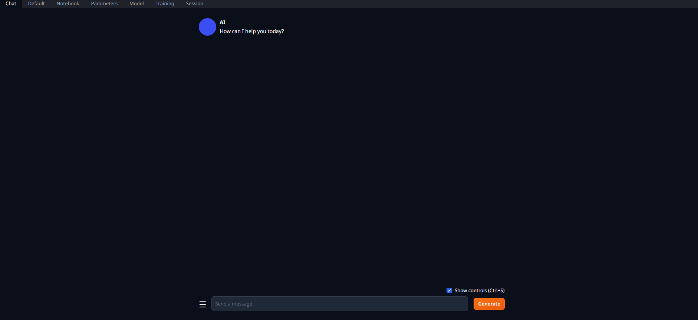
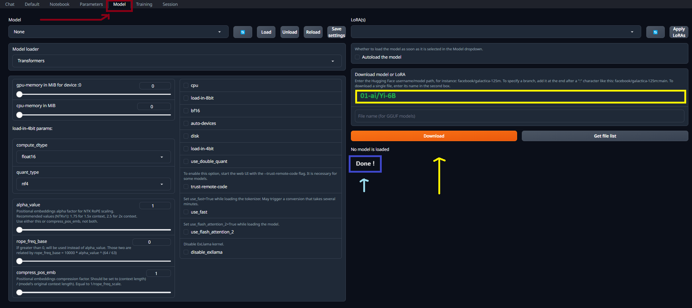

# LLaMA2-Interface

## Chapter 1: Download and Install

### Install locally with Text Generation WebUI

* #### Download and install [Anaconda](https://www.anaconda.com/download)


  * If you have free enviroment, skip this step. But if not,open anaconda prompt and create a new enviroment on each path you want :
    * ```
      (base) D:\> conda create -n textgen python=3.11.5
      ```
      you can replace your own enviroment name with textgen and python version which is installed on your system.
    * Active the enviroment you created with the command that conda give to you :

      * ```
        conda activate textgen
        ```
        However, when you want to activate the active enviroment :
      * ```
        conda deactivate
        ```
* #### Download and install [PyTorch](https://pytorch.org/get-started/locally/).


  * If your system has NVIDIA GPU, you can install version of PyTorch which is compatible with the version of [CUDA](https://docs.nvidia.com/cuda/cuda-installation-guide-microsoft-windows/index.html) :
    * ```
      conda install pytorch torchvision torchaudio pytorch-cuda=12.1 -c pytorch -c nvidia
      ```
  * If your system does not have an NVIDIA GPU or you don't install a CUDA compatible version of PyTorch, PyTorch will still work, but it will run on the CPU, which is significantly slower for deep learning tasks.
* #### Download and install [WebUI](https://github.com/oobabooga/text-generation-webui) :


  * With git which is installed on your system, get the interface:

    ```
    git clone https://github.com/oobabooga/text-generation-webui
    ```
* You have to change the directory in each drive where you downloaded the text-generation-webui, for example :

  * ```
    cd text-generation-webui
    ```
* Install all the required python modules :

  * ```
    pip install -r requirements.txt
    ```
* Now is the time to spin up the server :

  ```
  python server.py
  ```
  Conda should give you the URL, switch over to your browser and enter the URL.

  
* Next, go to "Model" tab and in yellow box paste the name of the model that you coppied from hugging face for instance we want to download the 01-ai/Yi-6B, depending on the model will take a little while finally, it shows "Done!" !

  
* whenever your model download, it's time to load it. but the point you should pay attention to that for loading model correctly, turn on the "trust_remote_code". So, it printed :  "Successfully loaded 01-ai/Yi-6B".
* Switch over to "Session" tab, Firstly,  if your type of model is "chat", change the Mode from "Default" to "chat". Secondly, click on "Apply and restart" button.
* Before test the model, move to "Parameters" tab and you can increase your "max_new_tokens" and  decrease "temperature" to zero. Consider you should check that what works best for you.
* Consequently, now you know how to setup all right.
