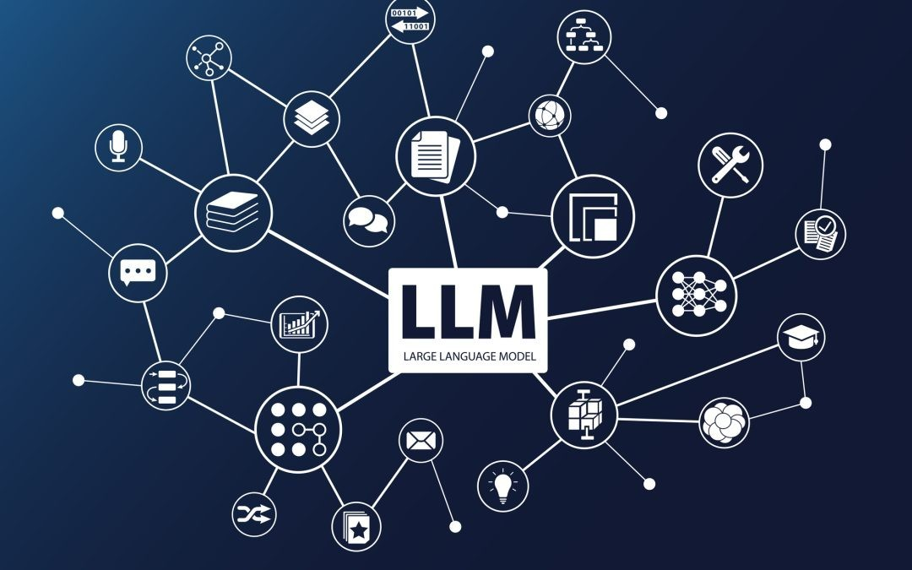

# LLM

## Chapter 1: Introduction to Artificial Intelligence

- Understanding AI and its Evolution
- Basics of Machine Learning and Deep Learning
- Role of Natural Language Processing (NLP)

### Chapter 2: Foundations of Language Models

- Introduction to Language Models
- Historical Perspective: From Rule-Based to Statistical Models
- Understanding N-gram Models and Limitations

### Chapter 3: The Rise of Neural Networks

- Introduction to Neural Networks
- Recurrent Neural Networks (RNNs) and their Role in NLP
- Understanding Long Short-Term Memory (LSTM) Networks

### Chapter 4: The Breakthrough of Transformer Models

- Introduction to Transformer Architecture
- Key Concepts: Attention Mechanism, Positional Encoding
- Advancements Over Previous Models

### Chapter 5: Large Language Models (LLMs)

- What Makes a Model 'Large'? Parameters and Layers
- Introduction to GPT, BERT, and other LLMs
- Training and Fine-Tuning LLMs

### Chapter 6: Applications of LLMs

- Natural Language Understanding and Generation
- Use Cases: Chatbots, Translation, Content Creation
- Ethical Considerations and Bias in LLMs

### Chapter 7: Advanced Topics in LLMs

- Latest Research and Developments in LLMs
- Understanding Zero-Shot and Few-Shot Learning
- Future Trends and Potential of LLMs

### Chapter 8: Practical Implementation

- Setting Up Your Environment for LLMs
- Working with OpenAI's GPT-4 and Other Models
- Building and Evaluating NLP Applications

### Chapter 9: Challenges and Future Directions

- Scaling Challenges and Computational Costs
- Addressing Bias and Fairness in LLMs
- The Future Landscape of AI and LLMs

### Chapter 10: Conclusion

- Summarizing Key Learnings
- The Broader Impact of LLMs on Society and Technology
- Continuing Your Journey in AI and LLM Research

Each chapter should be accompanied by practical exercises, case studies, and reading materials to deepen your understanding. Remember, the field of AI and LLMs is rapidly evolving, so staying updated with the latest research and developments is crucial.

```json
[
    afjaspfopasjf
]
```
